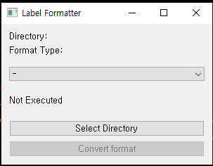

# 📑 LabelConverter

## 📋 요구사항
이 프로젝트에서는 다음 패키지가 필요합니다:

- json
- opencv-python  
#

## 🎈 기능

이 프로젝트에서 현재 사용 가능한 기능은 다음과 같습니다:

✔️ Labelme2Yolo

✔️ Labelme2Hubble

✔️ Yolo2Labelme


아직 구현되지 않은 기능은 다음과 같습니다:

❌ Lens2Hubble  

#
## 🎁 버전

현재 버전은 `0.1.0`입니다.  


## 🚀 사용 방법

1. `labelconverter.exe` 파일을 실행합니다.  
    

2. Format Type에서 원하는 형식을 설정합니다.  
    

3. `Select Directory` 버튼을 클릭하여 변환하려는 폴더로 이동합니다. 단, 클래스 이름이 존재하는 폴더로 이동해야 합니다.
    - 예시: 아래와 같은 폴더 구조가 있다면, `Animal` 폴더를 선택해야 합니다.
    
    ```
    Animal
    └── bear
    │   └── bear.png
    └── dog
    │   └── dog.png
    └── cat
        └── cat.png
    ```

    - 스크린샷 예시:  
    

4. `Convert format` 버튼을 클릭하여 원하는 형식으로 변경합니다.  

5. `Class-wise counts`는 해당 클래스의 이미지 장 수입니다.  

# 
## ⚠️ 주의사항
🔎 `labelme2YOLO`와 `Yolo2Labelme`는 선택된 폴더를 `os.listdir()`로 정렬하여 라벨을 부여합니다.

📝 예시:
- 디렉토리를 불러온 결과 (`os.listdir()`) : `['bear', 'dog', 'cat']` 📂
- 이에 번호를 매긴 `yolo_label` : `{'bear' : 0, 'cat' : 1, 'dog' : 2}` 🏷️

## 📥 다운로드
LabelConverter의 최신 버전을 다운로드하려면 [여기](https://github.com/lbg030/labelconverter/releases/latest)를 클릭하세요.